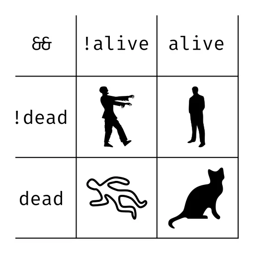

#### AI and ROSE

<p class="description">Design build and train an AI model for the ROSE game<p>

<p class="img"></p>

<p class="author">November, 2023<p>
<p class="author">Yaacov Zamir <a>&lt;yzamir@redhat.com&gt;</a><p>

---

#### Agenda

  - The ROSE project
  - **Demo** The game
  - AI, ML and ANN
  - Neural networks
  - **Demo** Perceptron
  - Designing and Building an ANN to solve the ROSE Game
  - **Demo** ROSE driver

---

#### The ROSE Project

ROSE (short for Red Hat Open Source for Education) is a cross-community effort lead by Red Hat Israel that brings students from Tira and Ra'anana to the Red Hat offices to learn about the Linux operating system and Python programming.

<p class="img"></p>

---

# Demo

<p class="subtitle">The driver</p>


  
---

**The engine**

Running the server:

```bash
podman run --rm --network host -it quay.io/rose/rose-server
```

---

**The driver I**

Running reference driver:
``` bash
podman run --rm --network host -it quay.io/rose/rose-go-driver --port 8082

curl -X POST -H "Content-Type: application/json" -d '{
            "info": {
                "car": {
                    "x": 3,
                    "y": 8
                }
            },
            "track": [
                ["", "", "bike", "", "", ""],
                ["", "crack", "", "", "trash", ""],
                ["", "", "penguin", "", "", "water"],
                ["", "water", "", "trash", "", ""],
                ["barrier", "", "", "", "bike", ""],
                ["", "", "trash", "", "", ""],
                ["", "crack", "", "", "", "bike"],
                ["", "", "", "penguin", "water", ""],
                ["", "", "bike", "", "", ""]
            ]
        }' http://localhost:8082/ -s | jq
```

---

**The driver II**

Writing some driver logic:

```python
from rose.common import obstacles, actions  # NOQA

driver_name = "My Driver"

def drive(world):
    x = world.car.x
    y = world.car.y
    obstacle = world.get((x, y - 1))

    if obstacle == obstacles.PENGUIN:
        return actions.PICKUP
    elif obstacle == obstacles.WATER:
        return actions.BRAKE
    elif obstacle == obstacles.CRACK:
        return actions.JUMP
    elif obstacle == obstacles.NONE:
        return actions.NONE
    else:
        return actions.RIGHT if (x % 3) == 0 else actions.LEFT
```

Running the driver:

```bash
podman run -it --rm --network host \
  -v $(pwd)/good_driver.py:/driver.py:z \
  quay.io/rose/rose-client \
  --driver /driver.py \
  --port 8081
```

---

**Play the game**

```bash
# The game engine running on port 8080
podman run --rm --network host -it quay.io/rose/rose-server

# Reference driver runnin on port 8082
podman run --rm --network host -it quay.io/rose/rose-go-driver --port 8082

# Our driver running on port 8081
podman run -it --rm --network host \
  -v $(pwd)/good_driver.py:/driver.py:z \
  quay.io/rose/rose-client \
  --driver /driver.py \
  --port 8081
```


---

#### AI, ML, ANN

**Artificial intelligence** (AI) is the intelligence of machines or software, as opposed to the intelligence of humans or animals. It is also the field of study in computer science that develops and studies intelligent machines. "AI" may also refer to the machines themselves.

**Machine learning** (ML) is a field of study in artificial intelligence concerned with the development and study of statistical algorithms that can effectively generalize and thus perform tasks without explicit instructions

A **neural network** is a neural circuit of biological neurons, sometimes also called a biological neural network, or a network of artificial neurons or nodes in the case of an artificial neural network.

ML is a means of achieving AI, where machines learn from data to make decisions with minimal human intervention.
ANNs are a technique in ML used to model complex patterns and prediction problems.

<p class="img"></p>

---

#### Neural networks

  - Graph
  - Forward propagation
    - Dot product
    - Activation function
  - Backword propagation
    - Error funtion
    - Chain rule

---

#### Graph


---

#### Biology analog


---

#### Dot product


Definition:
`$$ \mathbf{a} \cdot \mathbf{b} = \sum_{i=1}^{n} a_i b_i $$`

Example:
`$$ \mathbf{a} \cdot \mathbf{w} = a_1w_1 + a_2w_2 $$`

With numbers:
`$$ \mathbf{a} \cdot \mathbf{w} = (3 \times 5) + (4 \times 2) = 15 + 8 = 23 $$`

---

#### Activation function

Definition:

`$$ g(\mathbf{a}, \mathbf{w}, b) = g(\mathbf{w} \cdot \mathbf{a} + b) $$`

Example with ReLU:

`$$ g(\mathbf{a}, \mathbf{w}, b) = \max(0, \mathbf{w} \cdot \mathbf{a} + b) $$`


`$$ g(\mathbf{a}, \mathbf{w}, b) = \max(0, w_1a_1 + w_2a_2 + b) $$`

With numbers:

`$$ g(\mathbf{a}, \mathbf{w}, b) = \max(0, 2 \times 3 + 1 \times 4 - 5) = \max(0, 6 + 4 - 5) = \max(0, 5) = 5 $$`


---

#### Sigmoid

Sigmoid maps any real-valued number into the range (0, 1), making it useful for models where the output is a probability, like in logistic regression or simple binary classifiers.

`$$ \sigma(x) = \frac{1}{1 + e^{-x}} $$`


---

### Chain rule

Definition:

`$$ \frac{d}{dx} [f(g(x))] = f'(g(x)) \cdot g'(x) $$`

Example:

`$$ \frac{d}{dx} [(\sin(x))^2] = 2\sin(x) \cdot \cos(x) $$`


---

#### Error funtion

<p class="subtitle">Error functions measure the accuracy of a model in relation to actual observed data.</p>


---

#### Error funtion example

Error functions measure the accuracy of a model in relation to actual observed data.

For example Mean Square Error:

`$$ MSE = \frac{1}{n}\sum_{i=1}^{n} (y_i - \hat{y_i})^2 $$`
We can use ReLU as `$ y $` and observed data as `$ \hat{y} $`:
`$$ y_i = \text{ReLU}(x) = \max(0, x) $$`
`$$ x = \mathbf{w} \cdot \mathbf{a} + b $$`
`$$ MSE = \frac{1}{n}\sum_{i=1}^{n} (\max(0, \mathbf{w} \cdot \mathbf{a} + b) - \hat{y_i})^2 $$`

And the drivative is:
`$$ \frac{\partial \text{MSE}}{\partial \mathbf{w}} = 2(y_i - \hat{y_i}) \cdot [ \frac{\partial}{\partial \mathbf{w}}(\max(0, \mathbf{w} \cdot \mathbf{a} + b)) ] $$`
`$$ \frac{\partial}{\partial \mathbf{w}}(\max(0, \mathbf{w} \cdot \mathbf{a} + b)) = \begin{cases} \mathbf{a} & \text{if } \mathbf{w} \cdot \mathbf{a} + b > 0 \\ 0 & \text{otherwise} \end{cases} $$`

---

# Demo

<p class="subtitle">Python code implementing a perceptron</p>



---

#### AND, OR and XOR

<p class="img"></p>

<p class="img"></p>

---

Labeled some data
```python
inputs = np.array([[0, 0],
                   [0, 1],
                   [1, 0],
                   [1, 1]])
outputs = np.array([[0], [0], [0], [1]])
```

Run the activation function
```python
# Define a function to predict the output using the trained weights and bias
def predict(input_data):
    weighted_sum = np.dot(input_data, weights) + bias
    activated_output = sigmoid(weighted_sum)
    return activated_output
```

Adjust weights
```python
# Get model predictions
input_layer = inputs
activated_output = predict(input_layer)

# Get the loss estimate
loss = mse_loss(activated_output, outputs)

# Adjust weights and bias using backpropagation
adjustments = mse_derivative(activated_output, outputs) * sigmoid_derivative(activated_output)
weights += np.dot(input_layer.T, adjustments) * learning_rate
bias += np.sum(adjustments, axis=0) * learning_rate
```

---

Run the demo


```bash
cd demo2
python perceptron.py
```

---

#### ANN to solve the ROSE Game

  - Inputs (one hot)
  - Define the problem (classification)
  - Outputs (softmax)
  - Deep network (normalization, relu)

  <p class="img"></p>

---

#### Classification


---

#### One-hot encoding

"One-hot encoding" in the context of neural networks (NN) is a method used to convert categorical data into a numerical format that can be understood and processed by neural networks. In one-hot encoding, each categorical value is converted into a binary vector that has all zero values except for a single one at the position corresponding to the category.

Example of One-Hot Encoding:
Suppose we have a categorical feature "Color" with three categories: Red, Green, and Blue. Using one-hot encoding, we represent these categories as:

| Input | Encodeing |
|---|---------|
| Red| `[1, 0, 0]` |
| Green| `[0, 1, 0]` |
| Blue| `[0, 0, 1]` |

---

#### vanishing gradient problem

"vanishing gradient problem" is a significant challenge faced when training deep neural networks, particularly those using gradient-based learning methods and backpropagation.

**Careful Initialization**: Using specific strategies for weight initialization, to ensure the gradients don't vanish or explode.

**Using Relu Activation Function**: The ReLU (Rectified Linear Unit) activation function helps mitigate this problem since its derivative is either 0 (for negative inputs) or 1 (for positive inputs), reducing the risk of gradients diminishing too quickly.

**Batch Normalization**: Applying batch normalization normalizes the output of each layer to a certain range, which can help maintain a healthy gradient flow through the network.

**Skip Connections**: Architectures like ResNet introduce skip connections that bypass one or more layers by adding the output of one layer to the output of a deeper layer, helping mitigate the vanishing gradient problem by allowing an alternate pathway for the gradient.

**Shorter Networks or Different Architectures**: In some cases, using a shallower network or alternative architectures like convolutional neural networks (CNNs) or recurrent neural networks (RNNs) can be more effective.

---

#### softmax

The softmax function is a mathematical function commonly used in neural networks, particularly in the context of classification tasks. It transforms a vector of real numbers into a vector of probabilities, which sum up to 1.

**Input**: A vector of real numbers (scores or logits) from the last layer of a neural network.

**Output**: A probability distribution over predicted output classes.

The function is defined as:

`$$ \text{Softmax}(x_i) = \frac{e^{x_i}}{\sum_{j} e^{x_j}} $$`

---

#### ReLU

ReLU stands for Rectified Linear Unit, and it's one of the most widely used activation functions in neural networks, especially in deep learning models. Mathematically, it is defined as:

`$$ \text{ReLU}(x) = \begin{cases} x & \text{if } x > 0 \\ 0 & \text{otherwise} \end{cases} $$`


---

# Demo

<p class="subtitle">Training ANN to play the ROSE game</p>


---

Clone example repository
```bash
git clone git@github.com:yaacov/rose-ml-driver.git
cd rose-ml-driver
```

Run ML trainer
```bash
python train.py
```

Run ML driver
```bash
cd client
python main.py --listen 0.0.0.0 --driver ../driver.py 
```

---

Generate labeled data
```python
inputs = []
targets = []
for _ in range(batch_size):
    array = generate_obstacle_array()
    correct_output = driver_simulator(array, car_x)

    input_tensor = view_to_inputs(array)
    target_tensor = action_to_outputs(correct_output)

    inputs.append(input_tensor)
    targets.append(target_tensor)
return torch.stack(inputs), torch.stack(targets)
```

---

Train model
```python
# Get a batch of labeled training data
inputs, targets = generate_batch(batch_size)

# Reset the gradients in the optimizer (i.e., make it forget the gradients computed in the previous iteration)
optimizer.zero_grad()

# Forward pass: compute predicted outputs by passing inputs to the model
outputs = model(inputs)

# Compute loss: calculate the batch loss based on the difference between the predicted outputs and the actual targets
loss = criterion(outputs, targets)

# Backward pass: compute gradient of the loss with respect to model parameters
loss.backward()

# Perform a single optimization step (parameter update)
optimizer.step()
```

---
#### Reference

Rose - https://github.com/RedHat-Israel/ROSE

ML driver example - https://github.com/yaacov/rose-ml-driver

PyTorch - https://pytorch.org/

---

#### Questions


